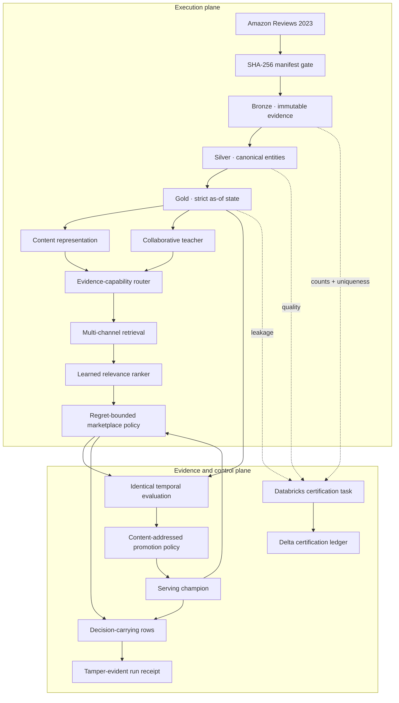

# Marketplace Cold-Start Recommender Lakehouse

> A time-correct, evidence-conditioned recommendation system for products that must earn exposure
> before they have enough behavior to train on.

New products face a feedback loop: no interactions means weak collaborative representations; weak
representations mean little exposure; little exposure means no interactions. This project attacks
both sides of that loop:

1. Build historically correct, replayable marketplace data in Bronze, Silver, and Gold.
2. Progressively specialize item representations as legitimate evidence becomes available.
3. Carry the evaluation policy and evidence chain all the way into serving—not just into a report.

This is an evidence-first portfolio project. It has processed real
[Amazon Reviews 2023](https://amazon-reviews-2023.github.io/) data in a live Databricks workspace,
but it does **not** claim to have trained on the full Amazon corpus or to have demonstrated CTR,
revenue, latency, or causal lift.

## Project at a glance

| Evidence | Verified result |
|---|---:|
| Live Databricks job | 6 serverless tasks; replay and fail-closed certification succeeded |
| Real landed input | 71,497 reviews + 3,391 product records |
| Canonical Silver output | 70,922 interactions + 3,391 parent products |
| Leakage-safe Gold output | 53,897 labels, sequences, and item snapshots |
| Real local model scope | 1,683 interactions from 400 repeat users |
| Real evaluation set | 263 positive test examples |
| Automated tests | 30 passing |
| Replay assertions | 0 duplicate Bronze/Silver IDs after a counted full replay |

The final live replay was Databricks run `144998663962696`. It completed all six tasks in 208.5
seconds, incremented both manifest replay counters to two, preserved every business row count, and
persisted a passing eleven-assertion certificate.


## What is built—and what is not

| Capability | Status | Evidence |
|---|---|---|
| Deterministic local Bronze-to-batch slice | **Verified** | `make demo`; integration and replay tests |
| Real Amazon Reviews ingestion | **Verified** | Magazine Subscriptions review and metadata objects |
| Live Databricks Bronze/Silver/Gold | **Verified** | Serverless bundle runs `813156246300863` and `144998663962696` |
| SHA-256 manifest gate | **Verified** | Databricks bootstrap recomputes both landed hashes before commit |
| Auto Loader replay | **Verified** | Full replay kept Bronze and Silver counts unchanged |
| Point-in-time features | **Verified** | Unit tests plus live SQL leakage assertions |
| Local content/collaborative hybrid | **Verified locally** | Deterministic exact-index evaluation |
| Pairwise learned ranking and reranking | **Verified locally** | Real and synthetic evaluation artifacts |
| Evidence-conditioned representation routing | **Verified locally** | Each serving row declares its legal signals and representation path |
| Policy-enforced champion serving | **Verified locally** | Aggregate, retrieval, and protected-cohort guardrails fail closed |
| Tamper-evident run receipts | **Verified locally** | Independent CLI verifies seven content-bound artifacts |
| Databricks pipeline certification | **Verified live** | Run `144998663962696`: 11/11 assertions passed and persisted in Delta |
| XGBoost LambdaMART adapter | Implemented, **not used in reported runs** | Optional `ml` dependency |
| MLflow logging adapter | Implemented, **not used in reported runs** | Optional Databricks dependency |
| Spark ALS, real SASRec, transformer embeddings | **Not trained** | Integration roadmap |
| Databricks Vector Search / ANN serving | **Not deployed** | Exact local index is the validation oracle |
| Online service performance | **Not measured** | Optional synthetic-persona FastAPI surface only |
| Electronics or all-domain benchmark | **Not run** | No large-scale throughput or cost claim |

## Measured results

### Live Databricks lakehouse

The same two files used by the real local run were landed in the managed Unity Catalog volume
`/Volumes/workspace/default/marketplace_landing` and processed with serverless job compute.

| Delta table | Rows |
|---|---:|
| `workspace.bronze.bronze_ingestion_manifest` | 2 |
| `workspace.bronze.bronze_reviews` | 71,497 |
| `workspace.bronze.bronze_product_metadata` | 3,391 |
| `workspace.silver.silver_products` | 3,391 |
| `workspace.silver.silver_interactions` | 70,922 |
| `workspace.gold.gold_training_labels` | 53,897 |
| `workspace.gold.gold_user_sequences_asof` | 53,897 |
| `workspace.gold.gold_item_statistics_asof` | 53,897 |
| `workspace.monitoring.pipeline_run_certifications` | 1 |

Post-replay SQL assertions:

| Assertion | Violations |
|---|---:|
| Manifest rows missing a committed SHA-256 | 0 |
| Duplicate deterministic Bronze record IDs | 0 |
| Rows routed to the managed quarantine table | 0 |
| Duplicate Silver interaction IDs | 0 |
| Flagged canonical interactions | 0 |
| Item feature timestamp `>=` label timestamp | 0 |
| User-history event timestamp `>=` label timestamp | 0 |

Both manifest objects report `replay_attempts = 2`, proving this was another counted replay rather
than a fresh first pass. The migration also backfilled deterministic `bronze_record_id` values into
the existing Delta tables before the streams ran, so deleting a checkpoint cannot silently append
the same raw records again.

The final task persisted `lakehouse-certification/v1` with `passed = true`, all eleven checks green,
and no failed check names. Its source-set digest is `583f28aa…98e5`; its materialized table-state
digest is `9a65c062…5fc5`. These are evidence identifiers, not security signatures.

### Real-data recommendation quality

The real experiment deliberately limits modeling to 400 repeat users so it stays reproducible on a
laptop. ETL processed 70,922 interactions; only 1,683 were in model scope, 1,009 preceded the
training cutoff, 884 candidate rows trained the ranker, and 263 positives were evaluated.

| Model | NDCG@10 | Recall@10 | Zero-history Recall@10 |
|---|---:|---:|---:|
| Popularity | **0.0711** | **0.1483** | 0.0000 |
| Content similarity | 0.0252 | 0.0494 | **0.0450** |
| Hybrid + learned ranker | 0.0264 | 0.0456 | 0.0180 |
| Full diversity reranker | 0.0256 | 0.0494 | 0.0180 |


Popularity is the strongest relevance baseline on this small real scope. The full system is 63.9%
below it on aggregate NDCG@10, and the user-level bootstrap interval for the delta is entirely
negative. Policy `d3fd0d03…c11d` passed retrieval coverage and zero-history Recall@10, but failed
aggregate NDCG@10 and sparse-cohort Recall@10. The model therefore fails closed, and the 8,000-row
real batch artifact is generated by popularity. Every row carries `serving_champion = popularity`
and the full promotion-policy ID. The underperforming candidate is evaluated, not quietly served.

Increasing the long-tail weight raised Top-10 long-tail exposure from 94.1% to 98.9%, while
NDCG@10 fell from 0.0264 to 0.0195. The experiment demonstrates the intended control surface, but
not a relevance-preserving win.


### Deterministic smoke result

The synthetic slice exists to exercise contracts and failure semantics, not to establish model
quality. It contains 240 interactions and 24 products, with 32 positive test examples. Its learned
candidate also fails the declared aggregate and sparse guardrails, so batch serving routes to the
content-similarity champion.

| Model | NDCG@10 | Recall@10 | Zero-history Recall@10 |
|---|---:|---:|---:|
| Popularity | 0.198 | 0.500 | 0.000 |
| Content similarity | **0.520** | 0.781 | 0.727 |
| Hybrid + learned ranker | 0.376 | **0.844** | **0.909** |
| Full diversity reranker | 0.385 | **0.844** | **0.909** |

### Volume, runtime, and cost boundaries

| Run | Input / ETL scope | Model-training scope | Runtime | Monetary cloud cost |
|---|---|---:|---:|---:|
| Synthetic local | 240 interactions | 144 interactions | Sub-second core stages | $0 incremental |
| Real local | 33.3 MB reviews + 4.1 MB metadata; 70,922 interactions | 1,009 interactions | 31.8 s measured stages | $0 incremental |
| Databricks certified replay | 71,497 reviews + 3,391 metadata rows | ETL + 11 assertions | 208.5 s job runtime | Not measured; Free Edition |
| Electronics integration | Not run | Not run | Not measured | Not measured |
| Full Amazon corpus | Not run | Not run | Not measured | Not measured |

## Architecture

### Thesis: time, evidence, and decisions are data

Most recommender diagrams end at a score. This design treats three additional objects as
first-class:

- **Knowledge time:** every feature states what was knowable before the decision timestamp.
- **Evidence capability:** an item can use only the content, behavior, graph, or popularity evidence
  it actually has; its representation progressively specializes as that evidence grows.
- **Decision provenance:** a serving row names the policy, champion, representation path, reason,
  and relevance-regret budget that produced it.

That creates two connected planes. The execution plane produces recommendations; the evidence plane
decides whether those recommendations are eligible to exist and makes the result independently
verifiable.



Gold reconstructs what was knowable at each label timestamp; the model is not allowed to repair
leakage after the fact. Evaluation does not merely recommend a champion: batch serving consumes that
exact decision. The resulting artifacts are content-bound into a receipt, while Databricks writes a
separate certification for the materialized table state.

### Abstraction without theater

| Boundary | Dependency-free executable oracle | Production replacement |
|---|---|---|
| Retrieval | Exact vector index | Vector Search or another ANN index, recall-tested against exact |
| Collaboration | Deterministic sequential co-occurrence teacher | ALS or a trained sequential model |
| Content | Signed feature hashing | Versioned transformer or multimodal encoder |
| Ranking | Pairwise linear ranker | LambdaMART or another group-aware learner |
| Policy | Content-addressed Python contract | Registered policy artifact and model alias transition |
| Evidence | SHA-256 run receipt | Signed attestation backed by immutable artifact storage |

The local implementations are validation oracles, not toy names for unimplemented services. Each
replacement has a stable input/output contract and a concrete comparison test before it can take
over.

### Key design decisions

| Decision | Why it matters |
|---|---|
| Recommend `parent_asin`, retain child `asin` | Prevent variants from crowding the list without losing lineage |
| Require `event_timestamp < label_timestamp` | Turns leakage prevention into a data contract, not a modeling convention |
| Gate every landed object by SHA-256 | Makes partial downloads and silent source changes fail closed |
| Blend content and collaboration by history count | Gives zero-history products a representation without discarding warm-item behavior |
| Compare against popularity and content on identical splits | Prevents a sophisticated architecture from hiding behind weak baselines |
| Content-address the promotion policy | A threshold change creates a new policy identity instead of silently changing deployment semantics |
| Route the selected champion into batch serving | Prevents evaluation and production from disagreeing about which model won |
| Bound marketplace objectives by score regret | Long-tail exposure cannot buy arbitrary relevance loss |
| Emit a tamper-evident receipt | Binds source hashes, time cutoffs, policy, claims, and output bytes into one verifiable object |

## Lakehouse contracts

| Layer | Principal outputs | Contract |
|---|---|---|
| Landing | JSONL objects | File is usable only after a matching SHA-256 is committed |
| Bronze | reviews, metadata, manifest, quarantine | Deterministic record ID, raw payload, checksum, row number, rescue data |
| Silver | parent products, variants, interactions | Stable keys, typed fields, deduplication, quality status |
| Gold | labels, sequences, item statistics | Every behavioral input is strictly earlier than its label time |
| Serving | batch recommendations | Champion, policy, evidence capabilities, decision reason, and score regret travel with every row |
| Monitoring | run certifications and receipts | A failed invariant fails the run; a changed artifact invalidates its receipt |

The recommendation unit is `parent_asin`; child `asin` remains available for lineage. An
`interaction_id` is a deterministic SHA-256 fingerprint of user, child ASIN, timestamp, and rating.

### Labels and eligibility

```text
positive:         verified_purchase = true AND rating >= 4
dissatisfaction:  verified_purchase = true AND rating <= 2
neutral:          rating = 3, excluded from the first label policy
```

At prediction time `t`, histories and aggregates may contain only events with timestamp `< t`.
Previously liked products are excluded from candidates. Crawl-time `average_rating`,
`rating_number`, and `price` are not historical features.

### Cold-start cohorts

| Cohort | Usable pre-cutoff interactions |
|---|---:|
| Zero-history | 0 |
| Sparse | 1–10 |
| Developing | 11–100 |
| Warm | >100 |

Because Amazon listing timestamps are absent, zero-history evaluation is simulated: the held-out
item loses its behavioral vector and ID representation while retaining permitted content. It is
not a claim about confirmed product launch time.

### Failure and recovery behavior

| Failure | Expected behavior | Checked by |
|---|---|---|
| Interrupted download | Partial object remains retryable; no committed manifest row | Implemented; not failure-injected in Databricks |
| Duplicate file | Existing checksum is treated as replay | Stable fingerprints and replay test |
| Completed Auto Loader replay | Checkpoint skips committed files without duplicating business keys | Successful live full replay |
| Malformed JSON | Bad row is quarantined; valid rows continue | Failure-injection test |
| New source field | Data lands in rescued payload until the contract changes | Implemented Auto Loader rescue path |
| Invalid key/rating/time | Row fails the Silver contract | Contract tests and quality output |
| Lost Gold output | Rebuild from Silver and the recorded cutoff | Designed path; live repair drill remains |
| Candidate model underperforms | Serving routes to the strongest baseline | Executable promotion and integration tests |
| Missing protected-cohort metric | Promotion fails closed | Policy contract test |
| Receipt or bound artifact is edited | Independent verification fails | Payload and artifact tampering tests |
| Lakehouse invariant breaks | Final Databricks task records failure and fails the job | Certification task |

## Recommender design

The checked local system is intentionally dependency-light:

1. A signed feature-hash encoder represents title, description, categories, brand, and attributes.
2. A sequential co-interaction teacher provides a deterministic collaborative signal.
3. A diagonal distiller maps content vectors toward collaborative vectors for warm products.
4. An evidence-capability resolver selects `content_cold_start`, `distilled_sparse_hybrid`,
   `warm_hybrid`, `collaborative_only`, `graph_seeded_fallback`, or `catalog_fallback` without
   inventing missing signals.
5. A count-aware gate assigns exactly zero collaborative weight to zero-history items.
6. Exact vector search validates retrieval behavior without pretending to be production ANN.
7. Hybrid, co-interaction, bought-together, and trend channels produce candidates with provenance.
8. A pairwise linear ranker scores candidates.
9. A constrained reranker may improve novelty, long-tail exposure, and redundancy only inside a
   normalized learned-score regret budget.
10. A content-addressed promotion policy checks aggregate NDCG, retrieval coverage, zero-history
    Recall@10, and sparse Recall@10. Missing metrics fail closed.
11. Batch serving executes the chosen champion and emits the policy and representation explanation.
12. A run receipt binds source versions, temporal cutoffs, policy, claims, and seven artifact hashes.

Spark ALS, a real SASRec implementation, transformer content encoders, LambdaMART training,
Databricks Vector Search, and online load testing are deliberately separate integration milestones.

## Run locally

Python 3.11+ is the only runtime requirement for the deterministic path:

```bash
make test
make demo
```

`make demo` creates Amazon-shaped fixtures and writes the full local path to `artifacts/local/`.
Run it twice to exercise replay behavior.

To download and process the real Magazine Subscriptions category:

```bash
make real-demo
```

The first real run downloads about 37.4 MB from Amazon Reviews 2023. Later runs reuse the validated
objects and preserve identical Silver and Gold business fingerprints.

For the complete deterministic verification used by CI:

```bash
python3 -m venv .venv
source .venv/bin/activate
python -m pip install -e ".[dev]"
make verify
```

That command checks lint and formatting, compiles the package, runs all tests, executes the demo
twice, proves replay stability, verifies that serving used the selected champion, independently
checks the run receipt and its seven artifacts, diff-checks the README evidence, and builds the
wheel.

To verify a run without trusting the process that created it:

```bash
make receipt
# or point the CLI at any run root:
marketplace-recommender verify-receipt --root <run-root> --receipt <receipt.json>
```

Important generated evidence:

```text
artifacts/local/monitoring/local_run_summary.json
artifacts/local/monitoring/run_receipt.json
artifacts/local/serving/gold_batch_recommendations.jsonl
artifacts/real-magazine/monitoring/local_run_summary.json
artifacts/real-magazine/monitoring/run_receipt.json
artifacts/real-magazine/monitoring/relevance_long_tail_frontier.json
artifacts/real-magazine/serving/gold_batch_recommendations.jsonl
```

## Deploy to Databricks Free Edition

The checked `dev` target uses the existing `workspace` catalog, serverless job compute, and a
managed volume named `marketplace_landing`. Free Edition does not require or expose a classic
cluster ID for this job.

Authenticate the Databricks CLI, create the volume once, and upload the files produced by
`make real-demo`:

```bash
databricks auth login --host https://<workspace-host> --profile <profile>

databricks volumes create workspace default marketplace_landing MANAGED -p <profile>
databricks fs mkdir dbfs:/Volumes/workspace/default/marketplace_landing/reviews -p <profile>
databricks fs mkdir dbfs:/Volumes/workspace/default/marketplace_landing/metadata -p <profile>

databricks fs cp artifacts/real-magazine/landing/reviews_Magazine_Subscriptions.jsonl \
  dbfs:/Volumes/workspace/default/marketplace_landing/reviews/reviews_Magazine_Subscriptions.jsonl \
  --overwrite -p <profile>
databricks fs cp artifacts/real-magazine/landing/meta_Magazine_Subscriptions.jsonl \
  dbfs:/Volumes/workspace/default/marketplace_landing/metadata/meta_Magazine_Subscriptions.jsonl \
  --overwrite -p <profile>

databricks bundle validate -t dev -p <profile>
databricks bundle deploy -t dev -p <profile>
databricks bundle run marketplace_pipeline -t dev -p <profile>
```

The deployed graph is:

```text
bootstrap checksum verification
        ├── bronze_reviews ──┐
        └── bronze_metadata ─┴── silver ── gold ── certify
```

`certify` evaluates eleven invariants inside Spark, hashes the source set and table state, and
upserts the result by Databricks run ID into
`workspace.monitoring.pipeline_run_certifications`. Any failed invariant is persisted and then
raises an error, so a green DAG is itself evidence—not merely evidence that tasks returned zero.

For a paid workspace, `infrastructure/terraform/` contains the starting point for separate
environment catalogs. Cloud storage credentials, grants, compute policies, and network controls
remain operator responsibilities.

## Repository map

```text
.
├── databricks.yml          # Serverless six-task deployment bundle
├── conf/                   # Local, real-local, integration, and benchmark profiles
├── infrastructure/        # Unity Catalog Terraform starting point
├── scripts/                # Databricks stage entrypoint
├── src/marketplace_recommender/
│   ├── ingestion/          # Download, checksum, manifest, validation
│   ├── pipelines/          # Bronze, Silver, Gold, Databricks adapters
│   ├── features/           # Sequences and strict point-in-time features
│   ├── retrieval/          # Baselines, distillation, hybrid vectors, exact ANN
│   ├── ranking/            # Candidate features, pairwise/LambdaMART rankers, reranker
│   ├── evaluation/         # Temporal splits, cohorts, metrics, bootstrap intervals
│   ├── governance/         # Promotion policy and tamper-evident run receipts
│   ├── serving/            # Batch contract and optional FastAPI surface
│   └── monitoring/         # Run summaries and quality metrics
├── tests/                  # Unit, contract, integration, leakage, failure injection
├── benchmarks/             # Reserved configurations and measured reports
└── dashboards/             # Reserved Databricks dashboard assets
```

Production logic lives in the package. Notebooks are exploration-only.

## Tests

```bash
make test
```

The suite currently covers:

- Source and canonical schema contracts.
- Parent-ASIN and nested real Amazon metadata shapes.
- Strict as-of joins and future-history rejection.
- Future-positive-safe negative sampling.
- Zero-history gate boundaries.
- Evidence-capability transitions and catalog fallbacks.
- Replay-safe deterministic storage.
- Corrupt-row quarantine without dropping valid rows.
- Fail-closed promotion with aggregate, retrieval, and protected-cohort guardrails.
- Marketplace-objective ordering at the exact relevance-regret boundary.
- Payload and artifact tampering detection.
- End-to-end Bronze-to-selected-champion serving materialization.

The GitHub Actions workflow runs `make verify` on Python 3.11, 3.12, and 3.13. Python 3.12 uploads
the complete deterministic run root, so the receipt and all seven bound artifacts remain
independently verifiable after CI.

## Remaining work before a production claim

In priority order:

1. Run a larger domain such as Electronics and publish exact bytes, duration, DBUs, and cloud cost.
2. Add and compare Spark MLlib ALS, a real sequential model, and a transformer content encoder.
3. Evaluate full-catalog retrieval with exact-vs-approximate recall and identical negative pools.
4. Train LambdaMART on a larger validation set and publish user-level confidence intervals.
5. Register data/model lineage and the executable promotion decision in MLflow model aliases.
6. Synchronize embeddings to Databricks Vector Search and benchmark index refresh behavior.
7. Load-test batch and optional online serving; report P50/P95/P99 and failure behavior.
8. Audit exposure by brand, category, history cohort, and popularity before any marketplace claim.

Promotion requires replay and leakage checks, non-inferior relevance and retrieval, protected-cohort
guardrails, reproducible table/model versions, and serving smoke tests. The current real hybrid does
not pass that gate.

## Intended use and limitations

This project is intended for offline development of a parent-product recommender that can represent
zero- and sparse-history inventory from product content. The optional public API accepts synthetic
`demo_` personas only.

Amazon reviews are selective observations, not impressions or clicks. Unobserved products are not
confirmed negatives. Product metadata is a crawl-time snapshot, and image URLs can disappear.
Popularity may encode seller and exposure inequities. Nothing here supports a claim about CTR,
conversion, revenue, causal marketplace impact, production latency, or full-corpus scale.

## License

MIT. See [LICENSE](LICENSE).
