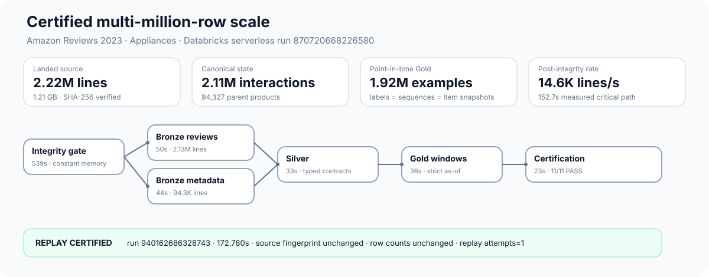
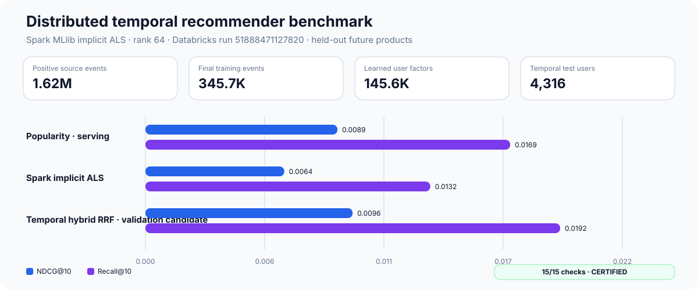
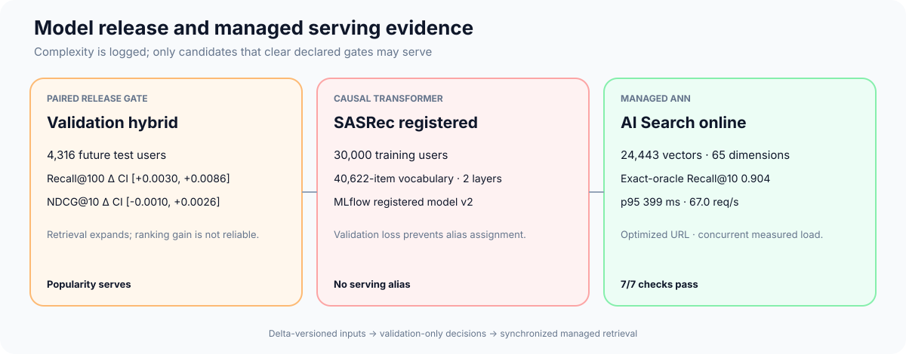
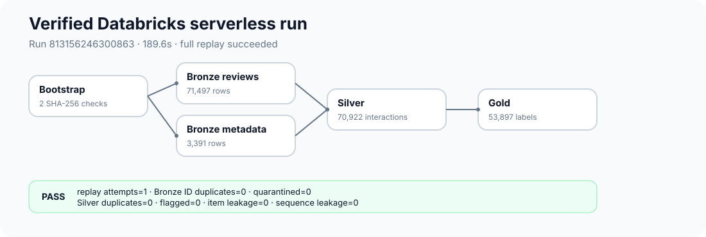
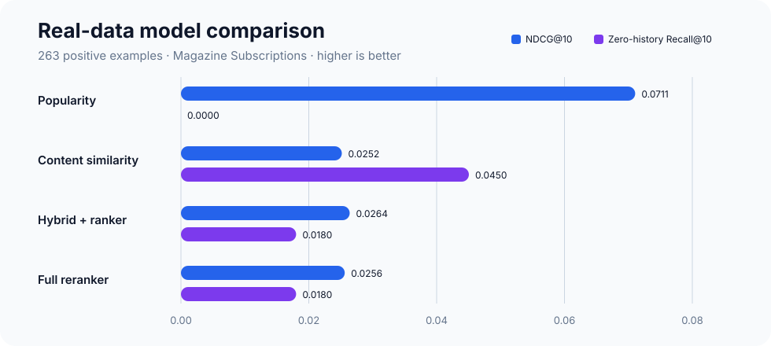
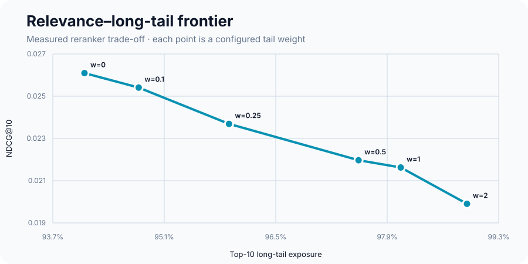
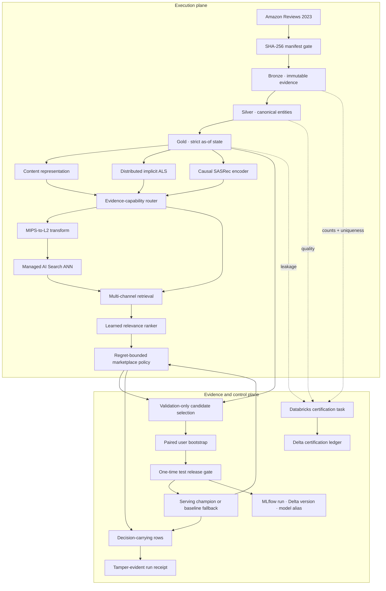

# Marketplace Cold-Start Recommender Lakehouse

> A time-correct, evidence-conditioned recommendation system for products that must earn exposure
> before they have enough behavior to train on.

New products face a feedback loop: no interactions means weak collaborative representations; weak
representations mean little exposure; little exposure means no interactions. This project attacks
both sides of that loop:

1. Build historically correct, replayable marketplace data in Bronze, Silver, and Gold.
2. Progressively specialize item representations as legitimate evidence becomes available.
3. Carry the evaluation policy and evidence chain all the way into serving—not just into a report.

This is an evidence-first portfolio project. It has processed a 2.22-million-line
[Amazon Reviews 2023](https://amazon-reviews-2023.github.io/) category in a live Databricks
workspace and replayed the result under the same contracts. It does **not** claim to have trained
on the full Amazon corpus or to have demonstrated CTR, revenue, causal lift, or a client-to-service
production latency SLO.

**Review path:** [measured results](#measured-results) · [architecture](#architecture) ·
[detailed evidence diagram](diagram.md) ·
[recommender design](#recommender-design) · [reproduce locally](#run-locally) ·
[deploy to Databricks](#deploy-to-databricks-free-edition) · [limitations](#intended-use-and-limitations)

## Project at a glance

| Evidence | Verified result |
|---|---:|
| Live Databricks scale job | 6 serverless tasks; initial run and counted replay certified |
| Checksummed landed input | 2,128,605 reviews + 94,327 product records; 1.215 GB |
| Content-addressed Bronze | 2,105,949 unique reviews + 94,327 unique product records |
| Canonical Silver output | 2,105,948 interactions + 94,327 parent products |
| Leakage-safe Gold output | 1,921,223 labels, sequences, and item snapshots |
| Post-integrity throughput | 2.22M lines transformed and certified in 152.653 s; 14.6K lines/s |
| Measured Delta footprint | 1,066,761,382 bytes across 106 files and 7 principal tables |
| Distributed model scope | 345,734 events; 145,552 user factors; 24,443 item factors |
| Paired temporal inference | 10,000 bootstrap samples across all 4,313 eligible future users |
| Release result | Hybrid Recall@100 gain is significant; NDCG gate fails; popularity stays live |
| Causal sequence scope | 47,850 examples; 30,000 users; 40,619-item vocabulary; MLflow model v1 |
| Managed ANN serving | 24,443 vectors; 0.904 Recall@10; p95 399 ms at concurrency 16 |
| Real local model scope | 1,683 interactions from 400 repeat users |
| Real evaluation set | 263 positive test examples |
| Automated tests | 56 passing |
| Replay assertions | 0 duplicate Bronze/Silver IDs after a counted full replay |

The clean scale run was `870720668226580`; its counted replay was `940162686328743`. Both passed
all eleven fail-closed assertions with zero temporal leakage. The replay completed in 172.780
seconds, preserved every business row count and the source-set fingerprint, and incremented both
manifest replay counters to one.



### What a reviewer can verify in 90 seconds

| Question | Short answer | Evidence path |
|---|---|---|
| Is the scale real? | 2.22M landed lines and 1.07 GB of measured Delta state | Scale chart and run IDs above |
| Is the ML real? | Distributed ALS plus a causal PyTorch Transformer, each with future holdouts | Model benchmarks below |
| Is leakage controlled? | Strict `< label_timestamp` windows plus live SQL assertions | Architecture and certification sections |
| Is replay real? | A second job preserved row counts and source/table fingerprints | Run `940162686328743` |
| Can I reproduce it? | Python-only deterministic oracle plus a serverless Asset Bundle | `make verify`; `databricks bundle run` |
| Does it hide weak results? | No; serving fails closed whenever the candidate loses | Model tables and promotion policy |
| Is retrieval operational? | Managed AI Search, Delta-version gating, exact recall, and concurrent load | ANN benchmark below |

## What is built—and what is not

| Capability | Status | Evidence |
|---|---|---|
| Deterministic local Bronze-to-batch slice | **Verified** | `make demo`; integration and replay tests |
| Real Amazon Reviews ingestion | **Verified** | Magazine Subscriptions and Appliances review/metadata objects |
| Live Databricks Bronze/Silver/Gold | **Verified** | Isolated scale schemas; certified run `870720668226580` |
| Multi-million-row batch scale | **Verified** | 2.22M landed lines; 2.11M Silver interactions; 1.92M aligned Gold rows |
| SHA-256 manifest gate | **Verified** | Databricks bootstrap recomputes both landed hashes before commit |
| Auto Loader replay | **Verified** | Run `940162686328743` kept Bronze, Silver, and Gold counts unchanged |
| Point-in-time features | **Verified** | Unit tests plus live SQL leakage assertions |
| Local content/collaborative hybrid | **Verified locally** | Deterministic exact-index evaluation |
| Pairwise learned ranking and reranking | **Verified locally** | Real and synthetic evaluation artifacts |
| Evidence-conditioned representation routing | **Verified locally** | Each serving row declares its legal signals and representation path |
| Policy-enforced champion serving | **Verified locally** | Aggregate, retrieval, and protected-cohort guardrails fail closed |
| Tamper-evident run receipts | **Verified locally** | Independent CLI verifies seven content-bound artifacts |
| Databricks pipeline certification | **Verified live** | Initial scale run and replay: 11/11 assertions persisted in Delta |
| XGBoost LambdaMART adapter | Implemented, **not used in reported runs** | Optional `ml` dependency |
| Distributed Spark MLlib implicit ALS | **Verified live** | Run `16821026705008`; 15/15 checks and paired intervals |
| Causal SASRec transformer | **Verified live, rejected** | Run `334941587375930`; 8/8 checks on 30,000 training users |
| MLflow deployment lineage | **Verified live** | Delta v2 → run `8c6ec944…a5d6` → registered model version 1 → no alias |
| Managed Databricks AI Search | **Verified live** | 24,443 vectors; synchronized Delta v27; 0.904 exact-oracle Recall@10 |
| Concurrent online retrieval load | **Verified live** | 500 requests at concurrency 16; p95 399 ms; 67.0 req/s |
| All-domain / full-corpus benchmark | **Not run** | Scale claim is limited to one 2.22M-line offline category |

## Measured results

### Demonstrated scale: Appliances

The `scale` bundle target is a separate evidence surface, not a larger value substituted into the
Magazine demo. It uses isolated `workspace.scale_*` schemas, a separate Unity Catalog landing path,
and the 1.215 GB Amazon Reviews 2023 Appliances category. The landing command counted every JSONL
line and computed both SHA-256 digests before upload; Databricks recomputed those digests before it
was allowed to write the manifest.

| Boundary | Measured result |
|---|---:|
| Landed source | 2,222,932 JSONL lines; 1,214,749,887 bytes |
| Review object | 2,128,605 lines; 929,451,412 bytes |
| Metadata object | 94,327 lines; 285,298,475 bytes |
| Unique Bronze state | 2,105,949 reviews + 94,327 metadata records |
| Canonical Silver state | 2,105,948 interactions + 94,327 parent products |
| Strict point-in-time Gold | 1,921,223 labels = sequences = item snapshots |
| Principal Delta footprint | 1,066,761,382 bytes; 106 files; 7 tables |

Exact-content addressing deliberately collapsed 22,656 duplicate review lines (1.019% of landed
lines); the source is immutable, so byte-identical records do not receive artificial identities
from file ordering. Silver contract processing yields one fewer canonical interaction.
Certification found zero duplicate record IDs, zero duplicate interaction IDs, zero flagged
interactions, and zero item or sequence leakage.

| Initial run stage | Execution time |
|---|---:|
| Constant-memory SHA-256 integrity gate | 539 s |
| Bronze reviews | 50 s |
| Bronze metadata, parallel with reviews | 44 s |
| Silver contracts and canonicalization | 33 s |
| Gold point-in-time windows | 36 s |
| Fail-closed certification | 23 s |

Run `870720668226580` took 695.653 seconds end to end. The cold integrity read was throttled on
Free Edition, so it is reported separately: from manifest completion to certified job completion,
the pipeline processed 2.22M landed lines in 152.653 seconds, or 14,561.99 landed lines/second.
This is an observed offline batch rate, not a latency SLO or a paid-workspace cost benchmark.

The replay, run `940162686328743`, completed in 172.780 seconds. It retained the source fingerprint
`68848385…bd9`, kept every table count identical, incremented both manifest replay counters from
zero to one, and wrote a second 11/11 certificate. Gold uses partitioned `RANGE ... -1` windows,
which exclude timestamp ties and require a bounded sort plan instead of label-to-history
self-joins that can grow quadratically.

| Delta table | Rows | Files | Size |
|---|---:|---:|---:|
| `workspace.scale_bronze.bronze_reviews` | 2,105,949 | 32 | 348,457,994 B |
| `workspace.scale_bronze.bronze_product_metadata` | 94,327 | 32 | 66,164,245 B |
| `workspace.scale_silver.silver_products` | 94,327 | 17 | 39,821,773 B |
| `workspace.scale_silver.silver_interactions` | 2,105,948 | 11 | 290,390,029 B |
| `workspace.scale_gold.gold_training_labels` | 1,921,223 | 2 | 111,749,431 B |
| `workspace.scale_gold.gold_user_sequences_asof` | 1,921,223 | 6 | 106,850,590 B |
| `workspace.scale_gold.gold_item_statistics_asof` | 1,921,223 | 6 | 103,327,320 B |

### Distributed recommender benchmark: Appliances

The independent serverless model job reads the certified 2.11M-row Silver table and scans
1,623,254 verified positive events. It uses a global 80/10/10 temporal policy: tune reciprocal-rank
fusion on the middle window, refit through the validation boundary, and touch the final future
window only once. Targets must be warm, previously unseen products; training history is removed
from every recommendation list.

The final Spark MLlib implicit ALS fit used rank 64, 12 iterations, confidence-weighted events,
345,734 training events collapsed into 345,066 user-product pairs, 145,552 user factors, and 24,443
item factors. Validation selected an ALS weight of 0.25 from the declared grid
`[0, 0.25, 0.5, 0.75, 1]`. The evaluation cap is 10,000, but the benchmark uses every eligible
user: 4,474 in validation and 4,313 in the untouched test window.

Run `16821026705008` succeeded in 299.398 seconds end to end; measured benchmark logic took
236.877 seconds. Contract `spark-als-temporal-benchmark/v4` passed 15/15 checks. Benchmark ID
`d4ba9380…fb721` binds Silver Delta version 2, temporal cutoffs, hyperparameters, and both model and
bootstrap implementation hashes; certificate summary `a1aa1a06…80c8` binds metrics, uncertainty,
the release decision, and artifact locations.

| Test model | Candidate Recall@100 | Recall@10 | NDCG@10 | Core coverage@10 |
|---|---:|---:|---:|---:|
| Popularity · serving | 0.0941 | **0.0169** | **0.0089** | 0.057% |
| Spark implicit ALS | 0.0512 | 0.0088 | 0.0045 | **3.248%** |
| Temporal hybrid RRF · validation candidate | **0.0985** | 0.0153 | 0.0076 | 0.221% |

The point estimates alone would invite a misleading story, so the release gate uses a deterministic
10,000-sample paired user bootstrap. The hybrid's Recall@100 delta is **+0.00441** with a 95% CI of
**[+0.00139, +0.00765]** and two-sided p≈0.004. Its NDCG@10 delta is **−0.00128** with a 95% CI of
**[−0.00290, +0.00038]** and p≈0.127; Recall@10 is likewise inconclusive. Validation therefore
nominates the hybrid as a useful retrieval candidate, but the one-time test release gate rejects
it and keeps popularity as the serving champion. The test chooses no hyperparameter and substitutes
no alternate learned model.

This result is more informative than the earlier 2,000-user point estimate: collaboration expands
the reachable candidate set, but ranking does not yet convert that signal into reliable top-ten
utility. Pure ALS also exposes 56.7× more of the collaborative core than serving popularity while
losing relevance. The architecture preserves both facts instead of equating complexity with a win.

Free Edition's Unity Catalog runtime does not permit MLlib's `recommendForUserSubset` higher-order
plan. The benchmark therefore trains ALS distributively, then evaluates the learned factors with a
bounded, blockwise exact scorer over the complete 24,443-item collaborative core for every eligible
validation and test user.
Spark performs temporal filtering, history exclusion, RRF, metrics, Delta materialization, and
certification. The final model, factors, 43,130 serving rows, paired user metrics, uncertainty
ledger, and a content-addressed 15-check certificate are persisted separately from ETL evidence.



### Sequential recommender and deployment lineage

The sequence path is a real SASRec-style model, not an LLM wrapper: a two-layer causal PyTorch
TransformerEncoder with four attention heads, 64-dimensional states, 20-event histories, sampled
pairwise loss, and validation-only epoch selection. It learned from 47,850 next-novel-product
examples across 30,000 users and a 40,619-item vocabulary, then refit through validation before a
single 4,000-user future test.

Run `334941587375930` succeeded in 604.642 seconds and passed all 8 contract checks. Popularity
again won honestly: test NDCG@10 was 0.00606 for popularity and 0.00053 for SASRec. The paired
SASRec-minus-popularity delta was **−0.00552**, with a 95% CI of
**[−0.00728, −0.00383]**. The candidate was therefore rejected.

That decision has operational consequences. MLflow run `8c6ec944…a5d6` records the exact Silver
Delta version, parameters, metrics, TorchScript artifact, and registration event. Unity Catalog
model `workspace.scale_serving.marketplace_sasrec_encoder` exists at version 1, while its serving
alias remains unset because validation failed. The Delta lineage ledger records the same rejected
decision. Registration proves reproducibility and auditability; an alias means deployment
eligibility, so the system never confuses “logged” with “approved.”

### Managed ANN retrieval and online load

Databricks AI Search endpoint `marketplace-recommender-search` now serves a Delta Sync index over
all 24,443 learned ALS item factors. Because AI Search uses L2 distance while ALS ranks by inner
product, each 64-dimensional item factor is transformed into an equivalent 65-dimensional
maximum-inner-product-to-L2 vector; queries receive a zero-valued final coordinate. Managed ANN
retrieves 500 candidates and the serving path exactly rescores that bounded pool with ALS factors.

Run `778127295675418` synchronized the index through source Delta commit 27 before issuing any
query, then passed all 7 checks. Quality was measured against a full exact inner-product oracle for
200 learned users. Load used the optimized index URL for 500 complete retrieval-and-rescore
requests at concurrency 16.

| Managed retrieval measure | Observed result | Release contract |
|---|---:|---:|
| Indexed rows | 24,443 / 24,443 | Complete |
| Exact-oracle Recall@10 | **0.904** | ≥ 0.85 |
| Latency p50 | 213.1 ms | Reported |
| Latency p95 | **399.3 ms** | ≤ 1,000 ms |
| Latency p99 | 439.1 ms | Reported |
| Completed throughput | **67.0 requests/s** | 500/500 without error |

This is measured service-side retrieval latency, including exact candidate rescoring. It is not a
browser-to-service production SLO, an autoscaling claim, or a paid-workspace capacity benchmark.
The first provisioning attempt also exposed a subtle operational hazard: an index may report
`ready=true` while Delta Sync is still active. Contract v3 therefore requires both
`ONLINE_NO_PENDING_UPDATE` and a processed commit at least as new as the data-bearing source
version before recall or latency can be certified.



### Live Databricks lakehouse

The same two files used by the real local run were landed in the managed Unity Catalog volume
`/Volumes/workspace/default/marketplace_landing` and processed with serverless job compute.

| Delta table | Rows |
|---|---:|
| `workspace.bronze.bronze_ingestion_manifest` | 2 |
| `workspace.bronze.bronze_reviews` | 71,497 |
| `workspace.bronze.bronze_product_metadata` | 3,391 |
| `workspace.silver.silver_products` | 3,391 |
| `workspace.silver.silver_interactions` | 70,922 |
| `workspace.gold.gold_training_labels` | 53,897 |
| `workspace.gold.gold_user_sequences_asof` | 53,897 |
| `workspace.gold.gold_item_statistics_asof` | 53,897 |
| `workspace.monitoring.pipeline_run_certifications` | 1 |

Post-replay SQL assertions:

| Assertion | Violations |
|---|---:|
| Manifest rows missing a committed SHA-256 | 0 |
| Duplicate deterministic Bronze record IDs | 0 |
| Rows routed to the managed quarantine table | 0 |
| Duplicate Silver interaction IDs | 0 |
| Flagged canonical interactions | 0 |
| Item feature timestamp `>=` label timestamp | 0 |
| User-history event timestamp `>=` label timestamp | 0 |

Both manifest objects report `replay_attempts = 2`, proving this was another counted replay rather
than a fresh first pass. The migration also backfilled deterministic `bronze_record_id` values into
the existing Delta tables before the streams ran, so deleting a checkpoint cannot silently append
the same raw records again.

The final task persisted `lakehouse-certification/v1` with `passed = true`, all eleven checks green,
and no failed check names. Its source-set digest is `583f28aa…98e5`; its materialized table-state
digest is `9a65c062…5fc5`. These are evidence identifiers, not security signatures.



### Local cold-start component benchmark

This dependency-light experiment deliberately limits modeling to 400 repeat users so the complete
content-routing, ranking, promotion, receipt, and serving path stays reproducible in CI. ETL
processed 70,922 interactions; 1,683 were in model scope, 1,009 preceded the training cutoff, 884
candidate rows trained the ranker, and 263 positives were evaluated. It complements the distributed
ALS benchmark; it is not the primary scale result.

| Model | NDCG@10 | Recall@10 | Zero-history Recall@10 |
|---|---:|---:|---:|
| Popularity | **0.0711** | **0.1483** | 0.0000 |
| Content similarity | 0.0252 | 0.0494 | **0.0450** |
| Hybrid + learned ranker | 0.0264 | 0.0456 | 0.0180 |
| Full diversity reranker | 0.0256 | 0.0494 | 0.0180 |



Popularity is the strongest relevance baseline on this small real scope. The full system is 63.9%
below it on aggregate NDCG@10, and the user-level bootstrap interval for the delta is entirely
negative. Policy `d3fd0d03…c11d` passed retrieval coverage and zero-history Recall@10, but failed
aggregate NDCG@10 and sparse-cohort Recall@10. The model therefore fails closed, and the 8,000-row
real batch artifact is generated by popularity. Every row carries `serving_champion = popularity`
and the full promotion-policy ID. The underperforming candidate is evaluated, not quietly served.

Increasing the long-tail weight raised Top-10 long-tail exposure from 94.1% to 98.9%, while
NDCG@10 fell from 0.0264 to 0.0195. The experiment demonstrates the intended control surface, but
not a relevance-preserving win.



### Deterministic smoke result

The synthetic slice exists to exercise contracts and failure semantics, not to establish model
quality. It contains 240 interactions and 24 products, with 32 positive test examples. Its learned
candidate also fails the declared aggregate and sparse guardrails, so batch serving routes to the
content-similarity champion.

| Model | NDCG@10 | Recall@10 | Zero-history Recall@10 |
|---|---:|---:|---:|
| Popularity | 0.198 | 0.500 | 0.000 |
| Content similarity | **0.520** | 0.781 | 0.727 |
| Hybrid + learned ranker | 0.376 | **0.844** | **0.909** |
| Full diversity reranker | 0.385 | **0.844** | **0.909** |

### Volume, runtime, and cost boundaries

| Run | Input / ETL scope | Model-training scope | Runtime | Monetary cloud cost |
|---|---|---:|---:|---:|
| Synthetic local | 240 interactions | 144 interactions | Sub-second core stages | $0 incremental |
| Real local | 33.3 MB reviews + 4.1 MB metadata; 70,922 interactions | 1,009 interactions | 31.8 s measured stages | $0 incremental |
| Databricks certified replay | 71,497 reviews + 3,391 metadata rows | ETL + 11 assertions | 208.5 s job runtime | Not measured; Free Edition |
| Databricks Appliances scale | 2.22M lines; 2.11M Silver interactions | ETL + 11 assertions | 695.653 s total; 152.653 s post-integrity | Not measured; Free Edition |
| Databricks scale replay | Same immutable source and table state | Replay + 11 assertions | 172.780 s job runtime | Not measured; Free Edition |
| Databricks distributed ALS | 1.62M verified positives scanned | 345,734 events; 145,552 user factors | 299.398 s job; 236.877 s measured logic | Not measured; Free Edition |
| Databricks causal SASRec | 1.62M verified positives scanned | 47,850 examples; 30,000 training users | 604.642 s job runtime | Not measured; Free Edition |
| Databricks managed ANN | 24,443 Delta-synced vectors | 200 exact-quality queries + 500 load requests | 277.957 s job; p95 399 ms retrieval | Not measured; Free Edition |
| Full Amazon corpus | Not run | Not run | Not measured | Not measured |

## Architecture

### Thesis: time, evidence, and decisions are data

Most recommender diagrams end at a score. This design treats three additional objects as
first-class:

- **Knowledge time:** every feature states what was knowable before the decision timestamp.
- **Evidence capability:** an item can use only the content, behavior, graph, or popularity evidence
  it actually has; its representation progressively specializes as that evidence grows.
- **Decision provenance:** a serving row names the policy, champion, representation path, reason,
  and relevance-regret budget that produced it.

That creates two connected planes. The execution plane produces recommendations; the evidence plane
decides whether those recommendations are eligible to exist and makes the result independently
verifiable.



Gold reconstructs what was knowable at each label timestamp; the model is not allowed to repair
leakage after the fact. Evaluation does not merely recommend a champion: batch serving consumes that
exact decision. The resulting artifacts are content-bound into a receipt, while Databricks writes a
separate certification for the materialized table state.

### Abstraction without theater

| Boundary | Dependency-free executable oracle | Production replacement |
|---|---|---|
| Retrieval | Exact vector index | Managed Databricks AI Search, recall-tested against exact |
| Collaboration | Deterministic local teacher | Distributed implicit ALS plus causal SASRec |
| Content | Signed feature hashing | Versioned transformer or multimodal encoder |
| Ranking | Pairwise linear ranker | LambdaMART or another group-aware learner |
| Policy | Content-addressed Python contract | Registered policy artifact and model alias transition |
| Evidence | SHA-256 run receipt | Signed attestation backed by immutable artifact storage |

The local implementations are validation oracles, not toy names for unimplemented services. Each
replacement has a stable input/output contract and a concrete comparison test before it can take
over.

### Key design decisions

| Decision | Why it matters |
|---|---|
| Recommend `parent_asin`, retain child `asin` | Prevent variants from crowding the list without losing lineage |
| Require `event_timestamp < label_timestamp` | Turns leakage prevention into a data contract, not a modeling convention |
| Gate every landed object by SHA-256 | Makes partial downloads and silent source changes fail closed |
| Store exact JSONL lines in Bronze | Avoids nested schema-inference cost and preserves additive source evolution for typed Silver parsing |
| Content-address Bronze records | Removes global file-order sorts; byte-identical records in one immutable object collapse deterministically |
| Build as-of state with partitioned time windows | Prevents the quadratic growth of label-to-history self-joins while excluding timestamp ties |
| Blend content and collaboration by history count | Gives zero-history products a representation without discarding warm-item behavior |
| Compare against popularity and content on identical splits | Prevents a sophisticated architecture from hiding behind weak baselines |
| Bootstrap matched user deltas | Quantifies uncertainty without breaking within-user policy pairing |
| Separate candidate selection from release qualification | Validation tunes; test is touched once and can retain the baseline |
| Transform ALS MIPS into L2 geometry | Lets managed ANN approximate the score ALS actually optimizes |
| Content-address the promotion policy | A threshold change creates a new policy identity instead of silently changing deployment semantics |
| Route the selected champion into batch serving | Prevents evaluation and production from disagreeing about which model won |
| Bound marketplace objectives by score regret | Long-tail exposure cannot buy arbitrary relevance loss |
| Emit a tamper-evident receipt | Binds source hashes, time cutoffs, policy, claims, and output bytes into one verifiable object |

## Lakehouse contracts

| Layer | Principal outputs | Contract |
|---|---|---|
| Landing | JSONL objects | File is usable only after a matching SHA-256 is committed |
| Bronze | reviews, metadata, manifest, quarantine | Exact raw line, content-addressed record ID, source checksum, replay checkpoint |
| Silver | parent products, variants, interactions | Stable keys, typed fields, deduplication, quality status |
| Gold | labels, sequences, item statistics | Every behavioral input is strictly earlier than its label time |
| Serving | batch recommendations | Champion, policy, evidence capabilities, decision reason, and score regret travel with every row |
| Monitoring | run certifications and receipts | A failed invariant fails the run; a changed artifact invalidates its receipt |

The recommendation unit is `parent_asin`; child `asin` remains available for lineage. An
`interaction_id` is a deterministic SHA-256 fingerprint of user, child ASIN, timestamp, and rating.

### Labels and eligibility

```text
positive:         verified_purchase = true AND rating >= 4
dissatisfaction:  verified_purchase = true AND rating <= 2
neutral:          rating = 3, excluded from the first label policy
```

At prediction time `t`, histories and aggregates may contain only events with timestamp `< t`.
Previously liked products are excluded from candidates. Crawl-time `average_rating`,
`rating_number`, and `price` are not historical features.

### Cold-start cohorts

| Cohort | Usable pre-cutoff interactions |
|---|---:|
| Zero-history | 0 |
| Sparse | 1–10 |
| Developing | 11–100 |
| Warm | >100 |

Because Amazon listing timestamps are absent, zero-history evaluation is simulated: the held-out
item loses its behavioral vector and ID representation while retaining permitted content. It is
not a claim about confirmed product launch time.

### Failure and recovery behavior

| Failure | Expected behavior | Checked by |
|---|---|---|
| Interrupted download | Partial object remains retryable; no committed manifest row | Implemented; not failure-injected in Databricks |
| Duplicate file | Existing checksum is treated as replay | Stable fingerprints and replay test |
| Completed Auto Loader replay | Checkpoint skips committed files without duplicating business keys | Successful live full replay |
| Malformed local JSON | Bad row is quarantined; valid rows continue | Failure-injection test |
| New source field | Exact raw line remains in Bronze until the versioned Silver contract adopts it | Live raw-line Auto Loader path |
| Invalid key/rating/time | Row fails the Silver contract | Contract tests and quality output |
| Lost Gold output | Rebuild from Silver and the recorded cutoff | Designed path; live repair drill remains |
| Candidate model underperforms | Serving routes to the strongest baseline | Executable promotion and integration tests |
| Missing protected-cohort metric | Promotion fails closed | Policy contract test |
| Receipt or bound artifact is edited | Independent verification fails | Payload and artifact tampering tests |
| Lakehouse invariant breaks | Final Databricks task records failure and fails the job | Certification task |

## Recommender design

The repository now has four complementary executable paths:

- **Distributed benchmark:** Spark MLlib trains confidence-weighted implicit ALS on the Appliances
  collaborative core. A global 80/10/10 time split tunes reciprocal-rank fusion on validation,
  refits before the test boundary, and evaluates only future, warm, previously unseen products.
- **Deterministic oracle:** the dependency-light local path exercises content cold start,
  evidence-conditioned routing, learned ranking, constrained reranking, promotion, and serving in
  CI without requiring Spark.
- **Sequence specialist:** a two-layer causal self-attention encoder learns next-novel-product
  behavior only for users with sufficient ordered history. It never replaces the cold-start path.
- **Managed retrieval:** ALS inner-product factors are transformed into equivalent 65-dimensional
  L2 vectors, Delta-synced into Databricks AI Search, and recall-tested against the exact oracle.

Together they implement this decision system:

1. A signed feature-hash encoder represents title, description, categories, brand, and attributes.
2. Spark implicit ALS learns collaborative factors; causal SASRec specializes sufficiently long
   histories; the local co-interaction teacher remains a deterministic contract oracle.
3. A diagonal distiller maps content vectors toward collaborative vectors for warm products.
4. An evidence-capability resolver selects `content_cold_start`, `distilled_sparse_hybrid`,
   `warm_hybrid`, `collaborative_only`, `graph_seeded_fallback`, or `catalog_fallback` without
   inventing missing signals.
5. A count-aware gate assigns exactly zero collaborative weight to zero-history items.
6. Exact search is the recall oracle; managed AI Search is the online ANN implementation.
7. Hybrid, co-interaction, bought-together, and trend channels produce candidates with provenance.
8. A pairwise linear ranker scores candidates.
9. A constrained reranker may improve novelty, long-tail exposure, and redundancy only inside a
   normalized learned-score regret budget.
10. Validation selects a candidate; a paired-bootstrap release gate checks the untouched test.
    Missing metrics or an inconclusive NDCG interval fail closed to popularity.
11. Batch serving executes the chosen champion and emits the policy and representation explanation.
12. MLflow binds the sequence encoder to its exact Delta version, metrics, run, registration, and
    candidate alias; a separate receipt binds local source versions and artifact hashes.

## Run locally

Python 3.11+ is the only runtime requirement for the deterministic path:

```bash
make test
make demo
```

`NVIDIA_API_KEY` is optional and intentionally absent from every core path. ALS, SASRec, AI Search,
evaluation, MLflow lineage, and serving do not call an external LLM. A future offline enrichment
job may use Nemotron to extract governed product attributes or generate reviewer-facing rationales,
but an LLM is not a sequential recommender and is never allowed to become a training dependency.
Local `.env` files are ignored; `.env.example` contains only an empty placeholder.

`make demo` creates Amazon-shaped fixtures and writes the full local path to `artifacts/local/`.
Run it twice to exercise replay behavior.

To download and process the real Magazine Subscriptions category:

```bash
make real-demo
```

The first real run downloads about 37.4 MB from Amazon Reviews 2023. Later runs reuse the validated
objects and preserve identical Silver and Gold business fingerprints.

For the complete deterministic verification used by CI:

```bash
python3 -m venv .venv
source .venv/bin/activate
python -m pip install -e ".[dev]"
make verify
```

That command checks lint and formatting, compiles the package, runs all tests, executes the demo
twice, proves replay stability, verifies that serving used the selected champion, independently
checks the run receipt and its seven artifacts, diff-checks the README evidence, and builds the
wheel.

To verify a run without trusting the process that created it:

```bash
make receipt
# or point the CLI at any run root:
marketplace-recommender verify-receipt --root <run-root> --receipt <receipt.json>
```

Important generated evidence:

```text
artifacts/local/monitoring/local_run_summary.json
artifacts/local/monitoring/run_receipt.json
artifacts/local/serving/gold_batch_recommendations.jsonl
artifacts/real-magazine/monitoring/local_run_summary.json
artifacts/real-magazine/monitoring/run_receipt.json
artifacts/real-magazine/monitoring/relevance_long_tail_frontier.json
artifacts/real-magazine/serving/gold_batch_recommendations.jsonl
```

## Deploy to Databricks Free Edition

The checked `dev` target uses the existing `workspace` catalog, serverless job compute, and a
managed volume named `marketplace_landing`. Free Edition does not require or expose a classic
cluster ID for this job.

Authenticate the Databricks CLI, create the volume once, and upload the files produced by
`make real-demo`:

```bash
databricks auth login --host https://<workspace-host> --profile <profile>

databricks volumes create workspace default marketplace_landing MANAGED -p <profile>
databricks fs mkdir dbfs:/Volumes/workspace/default/marketplace_landing/reviews -p <profile>
databricks fs mkdir dbfs:/Volumes/workspace/default/marketplace_landing/metadata -p <profile>

databricks fs cp artifacts/real-magazine/landing/reviews_Magazine_Subscriptions.jsonl \
  dbfs:/Volumes/workspace/default/marketplace_landing/reviews/reviews_Magazine_Subscriptions.jsonl \
  --overwrite -p <profile>
databricks fs cp artifacts/real-magazine/landing/meta_Magazine_Subscriptions.jsonl \
  dbfs:/Volumes/workspace/default/marketplace_landing/metadata/meta_Magazine_Subscriptions.jsonl \
  --overwrite -p <profile>

databricks bundle validate -t dev -p <profile>
databricks bundle deploy -t dev -p <profile>
databricks bundle run marketplace_pipeline -t dev -p <profile>
```

To reproduce the demonstrated Appliances scale run, download and validate the larger category,
land it under the isolated scale path, and select the checked `scale` target:

```bash
make scale-download

databricks fs mkdir \
  dbfs:/Volumes/workspace/default/marketplace_landing/scale/appliances/reviews -p <profile>
databricks fs mkdir \
  dbfs:/Volumes/workspace/default/marketplace_landing/scale/appliances/metadata -p <profile>
databricks fs cp artifacts/scale-appliances/landing/reviews_Appliances.jsonl \
  dbfs:/Volumes/workspace/default/marketplace_landing/scale/appliances/reviews/reviews_Appliances.jsonl \
  --overwrite -p <profile>
databricks fs cp artifacts/scale-appliances/landing/meta_Appliances.jsonl \
  dbfs:/Volumes/workspace/default/marketplace_landing/scale/appliances/metadata/meta_Appliances.jsonl \
  --overwrite -p <profile>

databricks bundle validate -t scale -p <profile>
databricks bundle deploy -t scale -p <profile>
databricks bundle run marketplace_pipeline -t scale -p <profile>
databricks bundle run marketplace_als_benchmark -t scale -p <profile>
databricks bundle run marketplace_sasrec_benchmark -t scale -p <profile>
databricks bundle run marketplace_vector_search_benchmark -t scale -p <profile>
```

The target fixes the two observed SHA-256 digests in source control and writes only to
`workspace.scale_bronze`, `scale_silver`, `scale_gold`, and the other `scale_*` schemas. Running it
again is the counted replay; no checkpoint deletion is part of the benchmark.

The deployed graph is:

```text
bootstrap checksum verification
        ├── bronze_reviews ──┐
        └── bronze_metadata ─┴── silver ── gold ── certify

certified Silver state ── temporal split ── ALS tune ── final refit ── model certify
                       ├── SASRec epoch search ── refit ── MLflow register/gate
ALS factors ── MIPS-to-L2 vectors ── Delta Sync AI Search ── recall/load certify
```

`certify` evaluates eleven invariants inside Spark, hashes the source set and table state, and
upserts the result by Databricks run ID into
`workspace.monitoring.pipeline_run_certifications`. Any failed invariant is persisted and then
raises an error, so a green DAG is itself evidence—not merely evidence that tasks returned zero.

For a paid workspace, `infrastructure/terraform/` contains the starting point for separate
environment catalogs. Cloud storage credentials, grants, compute policies, and network controls
remain operator responsibilities.

## Repository map

```text
.
├── databricks.yml          # Lakehouse, ALS, SASRec, and managed AI Search jobs
├── conf/                   # Local, real-local, integration, and benchmark profiles
├── infrastructure/        # Unity Catalog Terraform starting point
├── scripts/                # Databricks stage entrypoint
├── src/marketplace_recommender/
│   ├── ingestion/          # Download, checksum, manifest, validation
│   ├── pipelines/          # Bronze, Silver, Gold, Databricks adapters
│   ├── features/           # Sequences and strict point-in-time features
│   ├── retrieval/          # Spark ALS, SASRec, hybrid vectors, exact and managed ANN
│   ├── ranking/            # Candidate features, pairwise/LambdaMART rankers, reranker
│   ├── evaluation/         # Temporal splits, cohorts, metrics, bootstrap intervals
│   ├── governance/         # Promotion policy and tamper-evident run receipts
│   ├── serving/            # Batch contract and optional FastAPI surface
│   └── monitoring/         # Run summaries and quality metrics
├── tests/                  # Unit, contract, integration, leakage, failure injection
└── benchmarks/reports/     # Machine-readable measured evidence for public visuals
```

Production logic lives in the package; the repository has no notebook-only pipeline stages.

## Tests

```bash
make test
```

The suite currently covers:

- Source and canonical schema contracts.
- Parent-ASIN and nested real Amazon metadata shapes.
- Constant-memory landed-object hashing and isolated scale schemas.
- Raw-line, parallel content-addressed Bronze identity without global row ordering.
- Strict as-of joins and future-history rejection.
- Window-plan contracts that prohibit quadratic Gold history joins.
- Future-positive-safe negative sampling.
- Distributed ALS job wiring, deterministic high-cardinality indexing, and benchmark identity.
- Paired user bootstrap intervals and validation/test release separation.
- Causal SASRec masking, sampled pairwise loss, MLflow lineage, and fail-closed aliasing.
- MIPS-to-L2 equivalence, AI Search response contracts, and concurrent load summaries.
- Zero-history gate boundaries.
- Evidence-capability transitions and catalog fallbacks.
- Replay-safe deterministic storage.
- Corrupt-row quarantine without dropping valid rows.
- Fail-closed promotion with aggregate, retrieval, and protected-cohort guardrails.
- Marketplace-objective ordering at the exact relevance-regret boundary.
- Payload and artifact tampering detection.
- End-to-end Bronze-to-selected-champion serving materialization.

The GitHub Actions workflow runs `make verify` on Python 3.11, 3.12, and 3.13. Python 3.12 uploads
the complete deterministic run root, so the receipt and all seven bound artifacts remain
independently verifiable after CI.

## Remaining work before a production claim

In priority order:

1. Run a category-sharded, multi-file benchmark on paid compute and publish DBUs, dollars, shuffle,
   spill, and executor utilization—not just wall time.
2. Add a pretrained transformer or multimodal content encoder and compare it with signed feature
   hashing on the zero-history cohort.
3. Train LambdaMART on a larger validation set and quantify ranking uncertainty by cohort.
4. Audit exposure by brand, category, history cohort, and popularity before any marketplace claim.
5. Run a failure-injection drill for Vector Search refresh, serving degradation, and Gold rebuild.
6. Validate client-to-endpoint latency and autoscaling under representative paid-workspace traffic.

Promotion requires replay and leakage checks, non-inferior relevance and retrieval, protected-cohort
guardrails, reproducible table/model versions, and serving smoke tests. The dependency-light local
cold-start candidate, distributed hybrid, and SASRec candidate do not pass their release gates.
They remain measured research artifacts—not online marketplace claims.

## Intended use and limitations

This project is intended for offline development of a parent-product recommender that can represent
zero- and sparse-history inventory from product content. The optional public API accepts synthetic
`demo_` personas only.

Amazon reviews are selective observations, not impressions or clicks. Unobserved products are not
confirmed negatives. Product metadata is a crawl-time snapshot, and image URLs can disappear.
Popularity may encode seller and exposure inequities. The project demonstrates one certified
2.22-million-line offline batch and replay, a temporal ALS benchmark over 1.62M positive events and
all 4,313 eligible test users, and a bounded SASRec experiment on 30,000 training users. It does not
establish all-domain, paid-compute, or marketplace-traffic scale. Nothing here supports a claim
about CTR, conversion, revenue, causal marketplace impact, or a client-to-service production SLO.

## License

MIT. See [LICENSE](LICENSE).
