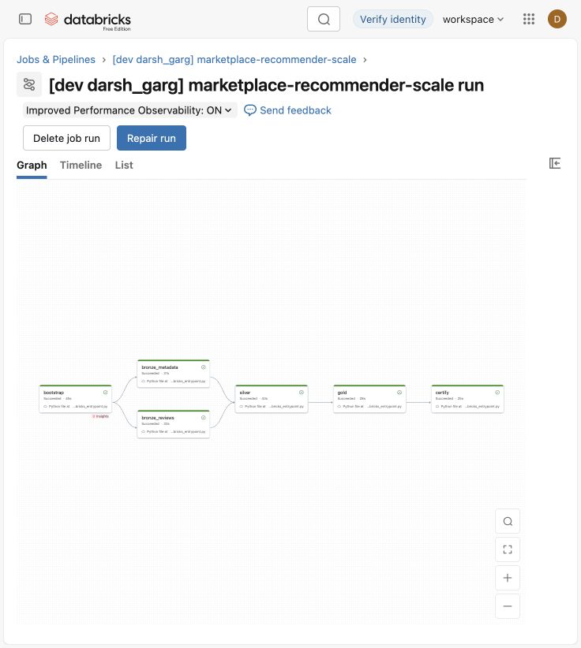
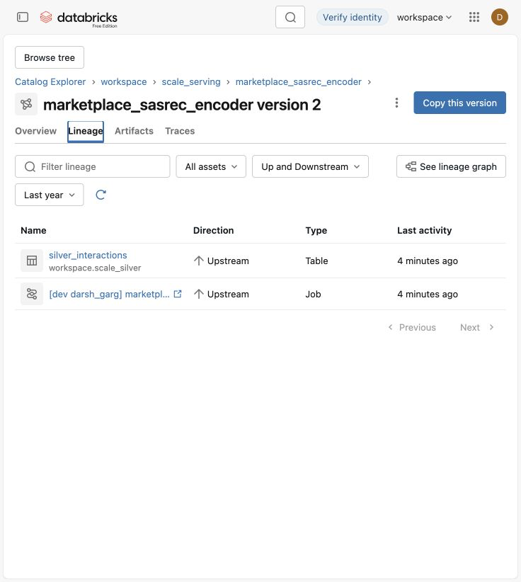
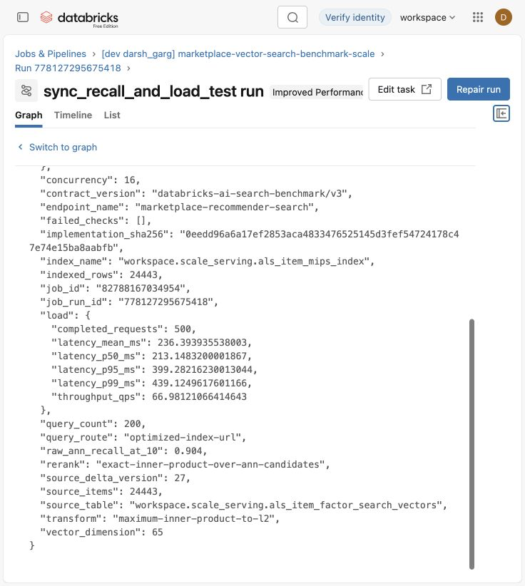
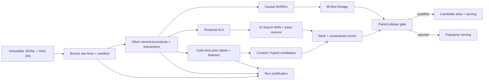

# Marketplace Cold-Start Recommender Lakehouse

[](https://github.com/darshgarg7/Recommender-Lakehouse/actions/workflows/ci.yml)
[](pyproject.toml)
[](LICENSE)

> An evidence-first Databricks reference system for recommending products before collaborative
> history exists—and for proving exactly when a more complex model is not ready to serve.

New products face a feedback loop: no interactions means weak collaborative representations;
weak representations mean little exposure; little exposure means no interactions. This project
breaks that loop with replay-safe lakehouse state, strict point-in-time features, content-aware
retrieval, distributed collaborative and sequential models, paired statistical inference, and a
release policy that fails closed to the strongest baseline.

The system has run against two real [Amazon Reviews 2023](https://amazon-reviews-2023.github.io/)
categories in Databricks Free Edition, including a 2.22-million-line Appliances target. It is a
portfolio reference architecture, not a production service: it does not claim marketplace
traffic, CTR or revenue lift, causal impact, paid-compute capacity, or a client-facing latency SLO.

**Review in 90 seconds:** [results](#measured-results) · [real workspace evidence](#real-workspace-evidence) ·
[architecture](#architecture) · [reproduce](#reproduce-it) · [limits](#claim-boundary)

## Why this repository is different

| Question | Executable answer |
|---|---|
| Can cold items be represented? | Content and graph fallbacks exist before behavior; collaboration is added only when evidence permits. |
| Is history leakage possible? | Gold windows require `event_timestamp < label_timestamp`; live certification tests the materialized tables. |
| Is ingestion replay-safe? | Landed bytes are SHA-256 gated, Bronze IDs are content-addressed, and a counted replay preserves business state. |
| Does sophisticated ML automatically win? | No. ALS broadens retrieval, but paired NDCG uncertainty fails the release gate; popularity stays champion. |
| Is sequence modeling real? | A causal PyTorch SASRec-style encoder is trained, logged, registered, evaluated, and correctly rejected. |
| Is ANN quality measured? | Databricks AI Search is synchronized by Delta version and compared with a complete exact-factor oracle. |
| Can evidence drift silently? | Tests bind benchmark claims to contract versions, source state, implementation-tree hashes, and generated assets. |

## Measured results

### One codebase, two catalog domains

The same package and six-task Asset Bundle run in isolated schemas for two different catalog
categories. This demonstrates cross-domain schema portability—not all-category or production
marketplace scale.

| Live target | Landed JSONL | Silver interactions | Point-in-time Gold | Purpose |
|---|---:|---:|---:|---|
| Magazine Subscriptions | 74,888 | 70,922 | 53,897 | second-domain portability |
| Appliances | 2,222,932 | 2,105,948 | 1,921,223 | scale, replay, and model benchmark |
| **Combined evidence** | **2,297,820** | **2,176,870** | **1,975,120** | two offline categories |

The Appliances input is 1,214,749,887 bytes. The certified Delta state spans 106 files and
1,066,761,382 measured bytes across seven principal tables. The original run processed and
certified the post-integrity critical path at 14,561.99 landed lines/second; a second counted run
preserved its source fingerprint, row counts, and all thirteen assertions.

### Honest model release

Spark MLlib implicit ALS trains on 345,734 events and produces 145,552 user factors and 24,443
item factors. A global temporal split selects reciprocal-rank fusion on validation, refits through
that boundary, and touches the future test only once.

| Appliances future test | Candidate R@100 | Recall@10 | NDCG@10 | Coverage@10 |
|---|---:|---:|---:|---:|
| Popularity · serving | 0.0943 | 0.0169 | 0.0089 | 0.057% |
| Spark implicit ALS | 0.0612 | 0.0132 | 0.0064 | **3.257%** |
| Temporal hybrid RRF | **0.1001** | **0.0192** | **0.0096** | 0.217% |

The selected hybrid improves candidate Recall@100 by **+0.00579**, with a matched-user 95%
interval of **[+0.00301, +0.00857]**. Its NDCG@10 delta is **+0.00070**, with a 95% interval of
**[−0.00099, +0.00262]**. The release rule requires the lower NDCG bound to exceed zero, so the
candidate is rejected and popularity remains the serving champion.

The causal SASRec candidate learns 47,853 next-novel-product examples from 30,000 users and a
40,622-item vocabulary. Its paired NDCG@10 delta versus popularity is **−0.00606**, 95% interval
**[−0.00786, −0.00447]**. MLflow records and registers the model for lineage, but no serving alias
is assigned. Registration is audit history; an alias is deployment eligibility.

### Managed vector retrieval

All 24,443 ALS item factors are converted from maximum-inner-product geometry to equivalent
65-dimensional L2 vectors, Delta-synchronized into Databricks AI Search, and exactly rescored after
bounded ANN retrieval.

| Managed benchmark | Observed | Contract |
|---|---:|---:|
| Exact-oracle Recall@10 | **0.904** | at least 0.85 |
| Latency p50 | 213.1 ms | reported |
| Latency p95 | **399.3 ms** | at most 1,000 ms |
| Latency p99 | 439.1 ms | reported |
| Completed throughput | **67.0 requests/s** | 500/500, concurrency 16 |

This is bounded Free Edition service-side retrieval and exact rescoring. It is not evidence of
browser latency, autoscaling, paid capacity, or a production SLO.

Exact configurations, table sizes, intervals, run identities, and caveats live in the
[benchmark report](benchmarks/reports/README.md) and
[machine-readable evidence](benchmarks/reports/portfolio_evidence.json).

## Real workspace evidence

These are sanitized captures from the signed-in Databricks workspace. Run IDs in the JSON are
correlation identifiers because the underlying workspace is private; the captures make the DAG,
lineage, and benchmark output reviewable without pretending those IDs are public links.

| Six-task serverless DAG | MLflow registered-model lineage |
|---|---|
|  |  |

<p align="center">
  
</p>

The DAG ends in a fail-closed certification task. The lineage view connects versioned Silver data,
the training run, and the Unity Catalog model. The AI Search output exposes indexed rows, request
count, concurrency, recall, latency, and throughput rather than only a green status.

## Architecture



The full [architecture narrative](diagram.md) covers ownership, temporal semantics, failure modes,
and serving decisions without claiming active production traffic or asymptotic guarantees for a
managed service.

### Lakehouse contracts

| Layer | Principal state | Fail-closed rule |
|---|---|---|
| Landing | immutable JSONL objects | recomputed SHA-256 must match the checked target |
| Bronze | raw line, source lineage, manifest, quarantine | no manifest commit before validation; replay cannot duplicate IDs |
| Silver | parent products, variants, interactions | typed keys, deterministic IDs, quality status, deduplication |
| Gold | labels, user sequences, item snapshots | every behavioral input is strictly earlier than its label |
| Models | factors, embeddings, metrics, uncertainty | validation selects; future test only qualifies release |
| Serving | recommendations and decision metadata | selected champion and representation reason travel with every row |
| Monitoring | certificates, lineage, receipts | changed state or a failed invariant invalidates the claim |

The recommendation unit is `parent_asin`; child `asin` remains for lineage. Crawl-time ratings,
rating counts, and price are never treated as historical features. Previously liked products are
removed from future candidates.

### Evidence-conditioned retrieval

Items move through representation paths based on signals that actually exist:

1. `content_cold_start` for zero-history inventory;
2. `distilled_sparse_hybrid` as limited interaction evidence appears;
3. `warm_hybrid` or `collaborative_only` for adequately observed items;
4. graph-seeded or catalog fallback when neither learned representation is legal.

Candidate provenance survives ranking. A constrained reranker may improve novelty, category
coverage, and long-tail exposure only within an explicit learned-score regret budget. Missing
protected-cohort or retrieval metrics make promotion fail rather than disappear from the report.

## Reproduce it

### Deterministic local path

Python 3.11+ is sufficient; Spark, Torch, Databricks, and an LLM key are not required.

```bash
python3 -m venv .venv
source .venv/bin/activate
python -m pip install -e ".[dev]"
make verify
```

`make verify` performs:

- bytecode compilation plus Ruff lint and format checks;
- MyPy static analysis over all source modules;
- an 85% branch-coverage floor for the deterministic core;
- behavioral unit, property, contract, leakage, failure-injection, and integration tests;
- two complete local runs to prove replay stability;
- independent verification of the receipt and its bound artifacts;
- generated-evidence drift detection and wheel construction.

Runtime-only Databricks, Spark, Torch, MLflow, AI Search, and serving adapters are explicitly
excluded from the local coverage denominator. Their behavior is certified by live runs. This keeps
the published threshold meaningful instead of inflating it with platform mocks.

Run the small synthetic path directly:

```bash
make demo
make receipt
```

Run the real Magazine Subscriptions path locally:

```bash
make real-demo
```

`NVIDIA_API_KEY` is optional and unused by every reported result. Nemotron may be useful in a
future governed offline attribute-enrichment experiment, but an LLM is not a sequential
recommender and is not a dependency of ALS, SASRec, AI Search, evaluation, or lineage.

### Databricks Asset Bundle

After landing the checked JSONL objects in the configured Unity Catalog volume:

```bash
databricks auth login --host https://<workspace-host> --profile <profile>
databricks bundle validate -t dev -p <profile>
databricks bundle deploy -t dev -p <profile>
databricks bundle run marketplace_pipeline -t dev -p <profile>

databricks bundle validate -t scale -p <profile>
databricks bundle deploy -t scale -p <profile>
databricks bundle run marketplace_pipeline -t scale -p <profile>
databricks bundle run marketplace_als_benchmark -t scale -p <profile>
databricks bundle run marketplace_sasrec_benchmark -t scale -p <profile>
databricks bundle run marketplace_vector_search_benchmark -t scale -p <profile>
```

The bundle uses serverless job environments, so no classic cluster ID is required in Free Edition.
Checksums, paths, schemas, and model parameters are declared in `databricks.yml` rather than hidden
in notebooks.

## Repository map

```text
.
├── databricks.yml                 # four serverless jobs and isolated targets
├── benchmarks/reports/            # exact public metrics and evidence ledger
├── assets/screenshots/            # sanitized live-workspace captures
├── conf/                          # deterministic local profiles
├── infrastructure/terraform/      # paid-workspace Unity Catalog starting point
├── scripts/                       # thin entrypoints and evidence generation
├── src/marketplace_recommender/
│   ├── ingestion/                 # bounded download, checksum, manifest, validation
│   ├── pipelines/                 # stage-owned Bronze, Silver, Gold, certification
│   ├── retrieval/                 # content, ALS, SASRec, exact and managed ANN
│   ├── ranking/                   # pairwise/LambdaMART adapters and constrained reranking
│   ├── evaluation/                # temporal splits, cohorts, metrics, bootstrap inference
│   ├── governance/                # release policy, code identity, signed receipts
│   └── serving/                   # selected-champion batch and optional API surface
└── tests/                         # behavioral, contract, leakage, recovery, integration
```

The former monolithic Databricks, ALS, and SASRec files are now stable import facades over
stage-owned modules. The largest responsibilities—data preparation, metrics, training, lineage,
and certification—can change and test independently.

## Claim boundary

What this repository demonstrates:

- deterministic and replay-safe lakehouse state over two real catalog categories;
- strict point-in-time features and materialized leakage assertions;
- multi-million-row serverless batch execution and measured Delta footprint;
- distributed collaborative training and a real causal sequence model;
- paired statistical confidence intervals and validation/test separation;
- managed vector retrieval with exact-oracle recall and concurrent load measurement;
- MLflow lineage whose alias state reflects the release decision;
- CI across Python 3.11, 3.12, and 3.13 with typing and coverage gates.

What it does not demonstrate:

- full Amazon, continuous multi-domain, multi-region, or multi-tenant scale;
- impressions, clicks, online experimentation, conversion, revenue, or causal lift;
- fairness or seller-exposure readiness for a live marketplace;
- paid-workspace DBUs, dollars, shuffle/spill, autoscaling, or failure-zone behavior;
- production security, networking, on-call operations, or a client-to-service SLO.

The next credible step is a category-sharded paid-compute benchmark that publishes cost and Spark
resource profiles, followed by impression-aware learning and an online experiment. Those are
explicitly future work, not implied capabilities.

## Evidence index

- [Detailed benchmark report](benchmarks/reports/README.md)
- [Machine-readable portfolio evidence](benchmarks/reports/portfolio_evidence.json)
- [Architecture and failure semantics](diagram.md)
- [Databricks Asset Bundle](databricks.yml)
- [CI verification workflow](.github/workflows/ci.yml)
- [Infrastructure starting point](infrastructure/terraform/)

## License

MIT. See [LICENSE](LICENSE).
