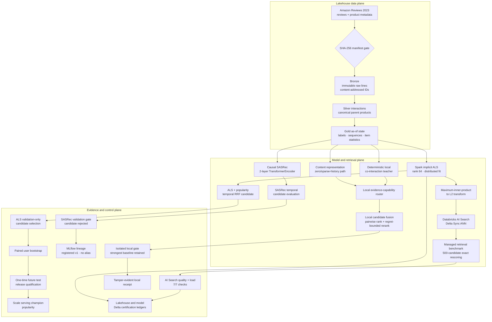
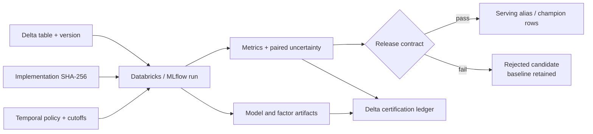

# Verified Architecture and Evidence Specification

## Marketplace Cold-Start Recommender Lakehouse

> **Classification:** portfolio-scale reference implementation with live Databricks evidence  
> **Data plane:** Databricks Asset Bundles, Unity Catalog, Delta Lake, PySpark, Auto Loader  
> **ML plane:** Spark implicit ALS, causal SASRec, managed AI Search, local cold-start ranking  
> **Control plane:** temporal evaluation, paired uncertainty, fail-closed release gates, MLflow lineage

This document describes what is implemented and measured. It is not a claim of marketplace
production deployment, causal lift, paid-workspace capacity, or client-to-service latency.
The scale demonstrations use the Amazon Reviews 2023 Appliances category: 2.22 million landed
JSONL rows, 2.11 million canonical interactions, and 1.92 million point-in-time Gold examples.

## 1. System topology

The architecture separates execution from evidence and control. A model may be trained and
registered without being eligible to serve.



The distributed hybrid and SASRec are measured candidates, not active champions. Both fail their
declared ranking gates. Popularity remains the certified serving model for the Appliances scale
benchmark. The dependency-light local demo has its own isolated decision and falls back to its
strongest local baseline.

## 2. Executable Databricks workflows

`databricks.yml` defines four independent serverless jobs so ETL, training, lineage, and retrieval
evidence do not masquerade as one successful task.

```mermaid
flowchart LR
    subgraph ETL["Certified lakehouse job · 6 tasks"]
        B0["bootstrap<br/>landed hashes"]
        B1["bronze reviews"]
        B2["bronze metadata"]
        S["silver contracts"]
        G["gold as-of windows"]
        C["certify<br/>11 checks"]
        B0 --> B1
        B0 --> B2
        B1 --> S
        B2 --> S
        S --> G --> C
    end

    subgraph AJ["ALS benchmark job"]
        A1["temporal split"] --> A2["validation RRF search"]
        A2 --> A3["refit through validation"]
        A3 --> A4["one-time test + 15 checks"]
    end

    subgraph SJ["SASRec benchmark job"]
        Q1["causal examples"] --> Q2["validation epoch selection"]
        Q2 --> Q3["refit + one-time test"]
        Q3 --> Q4["MLflow register + alias gate"]
    end

    subgraph VJ["Managed retrieval job"]
        V1["ALS item factors"] --> V2["65D MIPS-to-L2 vectors"]
        V2 --> V3["Delta Sync commit gate"]
        V3 --> V4["exact recall + concurrent load"]
    end

    C --> A1
    C --> Q1
    A4 --> V1
```



## 3. Lakehouse contracts

| Boundary | Materialized state | Fail-closed contract |
|---|---|---|
| Landing | Immutable JSONL objects | Byte count and SHA-256 must match the checked manifest |
| Bronze | Reviews, metadata, manifest, quarantine | Preserve raw lines; deduplicate by content hash |
| Silver | Parent products and typed interactions | Stable identifiers, valid keys/ratings/timestamps |
| Gold | Labels, user sequences, item statistics | Every behavioral input has timestamp `< label_timestamp` |
| Model evidence | Metrics, factors, uncertainty, certificates | Bind code hash, Delta version, split policy, and run ID |
| Serving | Ranked parent-product rows | Carry champion, policy ID, representation path, and decision reason |

Gold histories use partitioned `RANGE ... -1` windows. The exclusive upper bound prevents an event
at the label timestamp from entering its own features and avoids quadratic label-to-history joins.

## 4. Model paths and release state

### 4.1 Distributed implicit ALS and temporal hybrid

- Source: `workspace.scale_silver.silver_interactions`, Delta version 2.
- Positive policy: verified purchase with rating at least four.
- Final fit: 345,734 events, 145,552 users, 24,443 items, rank 64.
- Selection: reciprocal-rank-fusion weight chosen only on the validation window.
- Release: 10,000-sample paired bootstrap over all 4,313 eligible test users.

| Test path | Recall@100 | Recall@10 | NDCG@10 | Release state |
|---|---:|---:|---:|---|
| Popularity | 0.0941 | **0.0169** | **0.0089** | **Serving champion** |
| Spark implicit ALS | 0.0512 | 0.0088 | 0.0045 | Rejected |
| Temporal hybrid RRF | **0.0985** | 0.0153 | 0.0076 | Validation candidate; rejected by NDCG gate |

The hybrid Recall@100 delta is positive with 95% CI `[+0.00139, +0.00765]`. Its NDCG@10 delta is
negative and inconclusive with 95% CI `[-0.00290, +0.00038]`. Retrieval expansion alone is not
treated as a ranking win.

### 4.2 Causal SASRec

The sequential path is a real causal PyTorch Transformer, not a co-occurrence table or external
LLM. It uses two Transformer encoder layers, four attention heads, 64-dimensional states,
20-event histories, and sampled pairwise loss.

- Training scope: 47,850 examples from 30,000 users.
- Vocabulary: 40,619 products.
- Validation chooses the epoch; test never promotes the model.
- Test NDCG@10: popularity `0.00606`, SASRec `0.00053`.
- Paired SASRec-minus-popularity 95% CI: `[-0.00728, -0.00383]`.
- Deployment state: registered model version 1, rejected, no serving alias.

MLflow registration proves reproducibility and lineage. It does not imply deployment approval.

### 4.3 Local cold-start path

The deterministic local path exercises content representation, evidence-conditioned routing,
candidate fusion, a pairwise ranker, regret-bounded diversity, promotion, and decision-carrying
batch output. LambdaMART is available behind an optional dependency but is not used by the
reported runs. The learned local candidate also loses its aggregate gate and is not silently
served.

## 5. Managed ANN geometry and synchronization

ALS ranks items by inner product, while the managed index uses L2 distance. For item factor
`x`, query factor `q`, and `M² = max_i ||x_i||²`, the index stores:

```text
item:  x' = [x, sqrt(M² - ||x||²)]
query: q' = [q, 0]
```

Then:

```text
||q' - x'||² = ||q||² + M² - 2(q · x)
```

The first two terms are constant for a query, so exact L2 order equals exact ALS inner-product
order. This is an ordering equivalence, not a complexity claim about the managed implementation.

The managed retrieval benchmark uses Databricks AI Search as the approximate first stage, requests 500
candidates, and exactly rescores the bounded result set. Before any quality or latency query,
contract v3 requires:

1. `status.ready = true`.
2. `detailed_state = ONLINE_NO_PENDING_UPDATE`.
3. `last_processed_commit_version >=` the data-bearing source Delta version.
4. Indexed row count equals the 24,443-row factor source.

This prevents a stale-but-online index from producing publishable evidence.

| Managed retrieval evidence | Measured result |
|---|---:|
| Source commit | Delta version 27 |
| Vector shape | 24,443 × 65 |
| Exact-oracle quality queries | 200 |
| Recall@10 | **0.904** |
| Concurrent completed requests | 500 / 500 at concurrency 16 |
| Latency p50 / p95 / p99 | 213 ms / **399 ms** / 439 ms |
| Completed throughput | **67.0 requests/s** |

These are service-side retrieval-and-rescore measurements on Databricks Free Edition. They do not
establish browser latency, sustained marketplace traffic, autoscaling behavior, or paid-workspace
cost.

## 6. Evidence and lineage graph



Principal live evidence:

| Surface | Run ID | Contract | Outcome |
|---|---:|---|---|
| Appliances scale ETL | `870720668226580` | lakehouse certification v1 | 11/11 pass |
| Counted replay | `940162686328743` | replay and table-state invariants | 11/11 pass |
| Distributed ALS | `16821026705008` | temporal benchmark v4 | 15/15 pass; popularity retained |
| Causal SASRec | `334941587375930` | SASRec benchmark v1 | 8/8 pass; candidate rejected |
| Managed AI Search | `778127295675418` | AI Search benchmark v3 | 7/7 pass |

## 7. Failure semantics

| Failure | Required behavior |
|---|---|
| Landed checksum mismatch | Do not authorize ingestion |
| Duplicate replay | Preserve business row counts and increment replay evidence |
| Invalid Silver row | Route to quality output or fail its contract |
| Timestamp leakage | Fail certification and the Databricks job |
| Missing cohort or metric | Reject candidate promotion |
| Candidate loses relevance gate | Retain strongest baseline |
| Model registered but validation fails | Keep the registered version; assign no serving alias |
| AI Search sync is active or stale | Refuse recall and latency certification |
| Receipt-bound artifact changes | Independent receipt verification fails |

## 8. Demonstrated boundaries

This repository demonstrates offline lakehouse replay, distributed model training, uncertainty,
lineage, managed ANN quality, and bounded concurrent service load. It does not demonstrate:

- impressions, clicks, conversions, or confirmed negative exposure;
- causal CTR, revenue, or marketplace lift;
- an all-category Amazon benchmark;
- sustained paid-workspace traffic, cost, or autoscaling;
- a learned ranking model that beats popularity on the reported Appliances test;
- a client-to-service production SLO.

Those boundaries are intentional. The architecture treats an honest rejection as a successful
control-plane outcome rather than relabeling an underperforming model as a champion.
